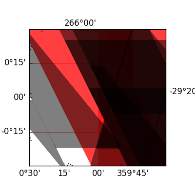

[](https://travis-ci.org/astrofrog/pytest-mpl)
[](https://ci.appveyor.com/project/astrofrog/pytest-mpl)

About
-----

This is a plugin to faciliate image comparison for [Matplotlib](http://www.matplotlib.org) figures in pytest.

Matplotlib includes a number of test utilities and decorators, but these are geared towards the [nose](http://nose.readthedocs.org/) testing framework. Pytest-mpl makes it easy to compare figures produced by tests to reference images when using [pytest](http://pytest.org).

For each figure to test, the reference image is substracted from the generated image, and the RMS of the residual is compared to a user-specified tolerance. If the residual is too large, the test will fail (this is implemented using helper functions from ``matplotlib.testing``).

For more information on how to write tests to do this, see the **Using** section below.

Installing
----------

This plugin is compatible with Python 2.6, 2.7, and 3.3 and later, and requires [pytest](http://pytest.org), [matplotlib](http://www.matplotlib.org) and
[nose](http://nose.readthedocs.org/) to be installed (nose is required by Matplotlib).

To install, you can do:

    pip install pytest-mpl

You can check that the plugin is registered with pytest by doing:

    py.test --version

which will show a list of plugins:

    This is pytest version 2.7.1, imported from ...
    setuptools registered plugins:
      pytest-mpl-0.1 at ...

Using
-----

To use, you simply need to mark the function where you want to compare images
using ``@pytest.mark.mpl_image_compare``, and make sure that the function
returns a Matplotlib figure (or any figure object that has a ``savefig``
method):

```python
import pytest
import matplotlib.pyplot as plt

@pytest.mark.mpl_image_compare
def test_succeeds():
    fig = plt.figure()
    ax = fig.add_subplot(1,1,1)
    ax.plot([1,2,3])
    return fig
```

To generate the baseline images, run the tests with the ``--mpl-generate-path``
option with the name of the directory where the generated images should be
placed:

    py.test --mpl-generate-path=baseline

If the directory does not exist, it will be created. The directory will be
interpreted as being relative to where you are running ``py.test``. Once you
are happy with the generated images, you should move them to a sub-directory
called ``baseline`` relative to the test files (this name is configurable, see
below). You can also generate the baseline images directly in the right directory.

You can then run the tests simply with:

    py.test --mpl

and the tests will pass if the images are the same. If you omit the ``--mpl``
option, the tests will run but will only check that the code runs without
checking the output images.

Options
-------

The ``@pytest.mark.mpl_image_compare`` marker can take an argument which is the
RMS tolerance (which defaults to 2):

```python
@pytest.mark.mpl_image_compare(tolerance=20)
def test_image():
    ...
```

You can also pass keyword arguments to ``savefig`` by using ``savefig_kwargs``:

```python
@pytest.mark.mpl_image_compare(savefig_kwargs={'dpi':300})
def test_image():
    ...
```

Other options include the name of the baseline directory (which defaults to
``baseline`` ) and the filename of the plot (which defaults to the name of the
test with a ``.png`` suffix):

```python
@pytest.mark.mpl_image_compare(baseline_dir='baseline_images',
                               filename='other_name.png')
def test_image():
    ...
```

The baseline directory in the decorator above will be interpreted as being
relative to the test file. Note that the baseline directory can also be a
URL (which should start with ``http://`` or ``https://`` and end in a slash).

Finally, you can also set a custom baseline directory globally when running
tests by running ``py.test`` with:

    py.test --mpl --mpl-baseline-path=baseline_images

This directory will be interpreted as being relative to where the tests are
run. In addition, if both this option and the ``baseline_dir`` option in the
``mpl_image_compare`` decorator are used, the one in the decorator takes
precedence.

Test failure example
--------------------

If the images produced by the tests are correct, then the test will pass, but if they are not, the test will fail with a message similar to the following:

```
E               Exception: Error: Image files did not match.
E                 RMS Value: 142.2287807767823
E                 Expected:
E                   /var/folders/zy/t1l3sx310d3d6p0kyxqzlrnr0000gr/T/tmp4h4oxr7y/baseline-coords_overlay_auto_coord_meta.png
E                 Actual:
E                   /var/folders/zy/t1l3sx310d3d6p0kyxqzlrnr0000gr/T/tmp4h4oxr7y/coords_overlay_auto_coord_meta.png
E                 Difference:
E                   /var/folders/zy/t1l3sx310d3d6p0kyxqzlrnr0000gr/T/tmp4h4oxr7y/coords_overlay_auto_coord_meta-failed-diff.png
E                 Tolerance:
E                   10
```

The image paths included in the exception are then available for inspection:

| Expected      | Actual        | Difference |
| ------------- | ------------- | ---------- |
|  |   |  |

In this case, the differences are very clear, while in some cases it may be
necessary to use the difference image, or blink the expected and actual images,
in order to see what changed.

The default tolerance is 2, which is very strict. In some cases, you may want
to relax this to account for differences in fonts across different systems.

Running the tests for pytest-mpl
--------------------------------

If you are contributing some changes and want to run the tests, first install the latest version of the plugin then do:

    cd tests
    py.test --mpl

The reason for having to install the plugin first is to ensure that the plugin
is correctly loaded as part of the test suite.
