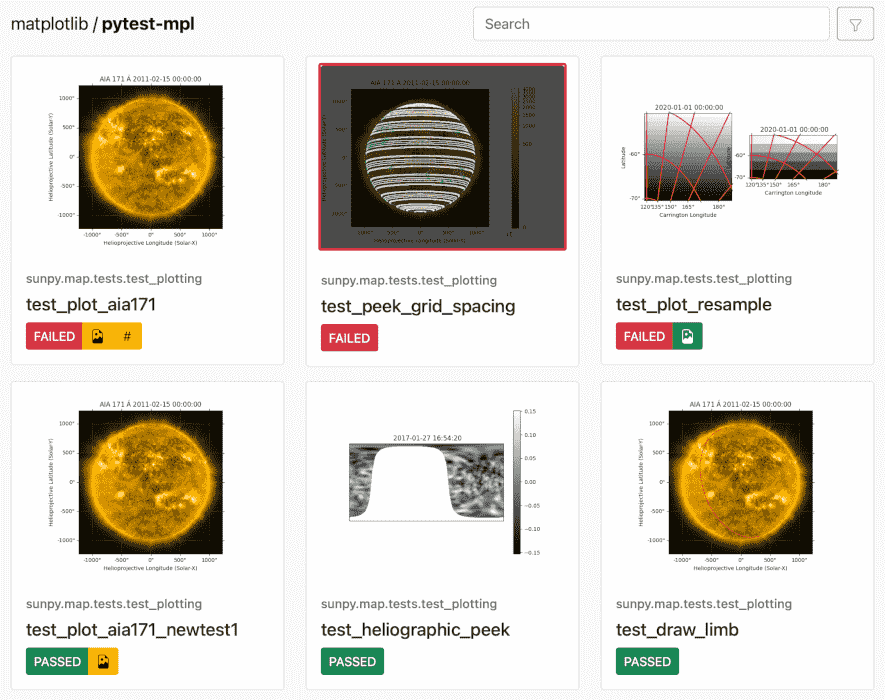
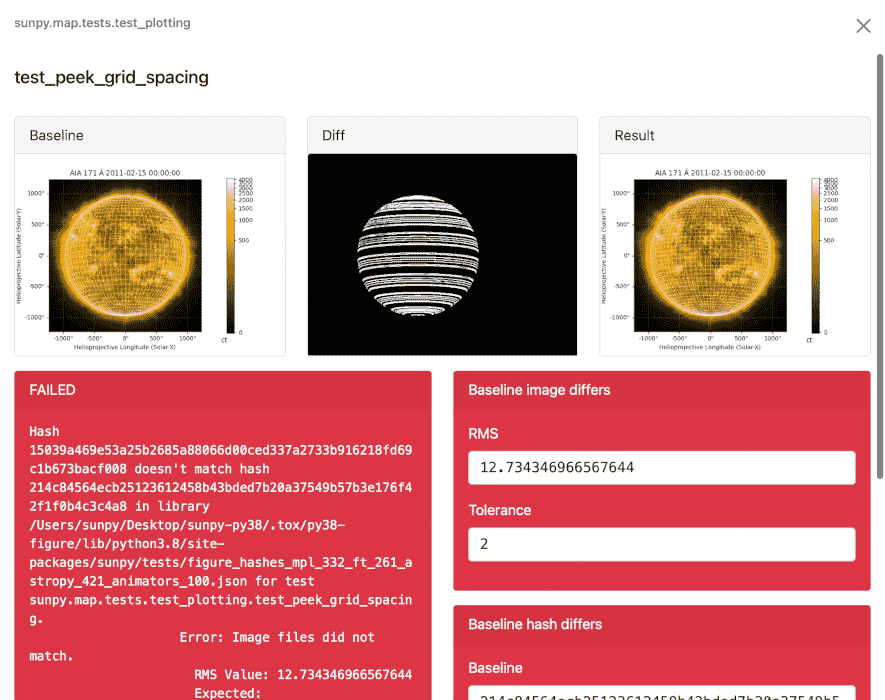

``pytest-mpl``
==============

``pytest-mpl`` is a `pytest <https://docs.pytest.org>`__ plugin to facilitate image comparison for `Matplotlib <http://www.matplotlib.org>`__ figures.

For each figure to test, an image is generated and then subtracted from an existing reference image.
If the RMS of the residual is larger than a user-specified tolerance, the test will fail.
Alternatively, the generated image can be hashed and compared to an expected value.

For more information, see the `pytest-mpl documentation <https://pytest-mpl.readthedocs.io>`__.

Installation
------------
.. code-block:: bash

   pip install pytest-mpl

For detailed instructions, see the `installation guide <https://pytest-mpl.readthedocs.io/en/latest/installing.html>`__ in the ``pytest-mpl`` docs.

Usage
-----
First, write test functions that create a figure.
These image comparison tests are decorated with ``@pytest.mark.mpl_image_compare`` and return the figure for testing:

.. code-block:: python

   import matplotlib.pyplot as plt
   import pytest

   @pytest.mark.mpl_image_compare
   def test_plot():
       fig, ax = plt.subplots()
       ax.plot([1, 2])
       return fig

Then, generate reference images by running the test suite with the ``--mpl-generate-path`` option:

.. code-block:: bash

   pytest --mpl-generate-path=baseline

Then, run the test suite as usual, but pass ``--mpl`` to compare the returned figures to the reference images:

.. code-block:: bash

   pytest --mpl

By also passing ``--mpl-generate-summary=html``, a summary of the image comparison results will be generated in HTML format:

+---------------+---------------+---------------+
| |html all|    | |html filter| | |html result| |
+---------------+---------------+---------------+

For more information on how to configure and use ``pytest-mpl``, see the `pytest-mpl documentation <https://pytest-mpl.readthedocs.io>`__.

Contributing
------------
``pytest-mpl`` is a community project maintained for and by its users.
There are many ways you can help!

- Report a bug or request a feature `on GitHub <https://github.com/matplotlib/pytest-mpl/issues>`__
- Improve the documentation or code

.. |html filter| image:: docs/images/html_filter.png

