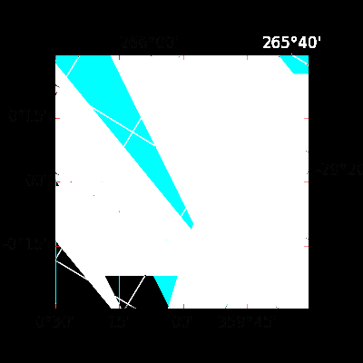

.. title:: Get Started

###########
Get Started
###########

This section describes how to configure simple image comparison testing with ``pytest-mpl``.
It assumes that you already have a `pytest <https://docs.pytest.org>`__ test suite set up for your project.

Install ``pytest-mpl``
^^^^^^^^^^^^^^^^^^^^^^

First, install ``pytest-mpl`` and also include it in your project's "test" dependencies:

.. code-block:: python

   pip install pytest-mpl

Write image comparison tests
^^^^^^^^^^^^^^^^^^^^^^^^^^^^

Then, alongside your existing tests, write test functions that create a figure.
These image comparison tests must be decorated with ``@pytest.mark.mpl_image_compare`` and return the figure for testing:

.. code-block:: python

   import matplotlib.pyplot as plt
   import pytest

   @pytest.mark.mpl_image_compare
   def test_plot():
       fig, ax = plt.subplots()
       ax.plot([1, 2])
       return fig

Generate baseline images
^^^^^^^^^^^^^^^^^^^^^^^^

Then, generate reference images by running the test suite with the ``--mpl-generate-path`` option:

.. code-block:: bash

   pytest --mpl-generate-path=baseline

If, for example, you are using a directory structure like this:

.. code-block::

   .
   └── tests
       ├── plotting
       │   └── test_plotting.py
       └── utils
           └── test_utils.py

Then, the generated images will be placed in a new directory called ``baseline`` located where you ran pytest:

.. code-block::

   .
   ├── baseline
   │   ├── test_plot.png
   │   └── test_util.png
   └── tests
       ├── plotting
       │   └── test_plotting.py
       └── utils
           └── test_utils.py

Take a look at the generated images inside the new ``baseline`` directory.
If they are correct, move each baseline image to a sub-directory called ``baseline`` relative to the test files:

.. code-block::

   .
   └── tests
       ├── plotting
       │   ├── baseline
       │   │   └── test_plot.png
       │   └── test_plotting.py
       └── utils
           ├── baseline
           │   └── test_util.png
           └── test_utils.py

Then, commit these baseline images to your repository.

Run the image comparison tests
^^^^^^^^^^^^^^^^^^^^^^^^^^^^^^

You now have a set of baseline images that can be used to verify the figures generated by your code.
You can now run the test suite as usual.
To enable image comparison testing, pass ``--mpl``:

.. code-block:: bash

   pytest --mpl

You should observe that the tests pass.

Try modifying the test function and run the test suite again.
The test should now fail, because the generated image does not match the reference image.
Try running the test suite without ``--mpl``.
Even through the figure has changed, the test will pass, because image comparison testing is disabled.

.. rubric:: Running pytest without pytest-mpl installed

If ``pytest-mpl`` is not installed, the image comparison tests will cause pytest to show a warning, ``PytestReturnNotNoneWarning``.
Installing pytest-mpl will solve this issue.
When ``pytest-mpl`` is installed but not enabled, it will intercept the returned figure and close it without doing any comparison.

Alternatively, the image comparison tests can be deselected by running pytest with ``-m "not mpl_image_compare"``.
Or the following can be included in your test functions to skip if ``pytest-mpl`` is not installed:

.. code-block:: python

   @pytest.mark.mpl_image_compare
   def test_plot():
       pytest.importorskip("pytest_mpl")
       ...

.. rubric:: Tests can fail when Matplotlib and FreeType versions change

If the Matplotlib version changes, or if the FreeType version changes, the generated images may change.
This is mostly because the text rendering in Matplotlib is dependent on the FreeType version.
It is recommended to pin the Matplotlib and FreeType versions in your testing environments to avoid this issue.
There are also a number of :ref:`configuration options for controlling the sensitivity of the comparison <controlling-sensitivity>`.

Image comparison mode
^^^^^^^^^^^^^^^^^^^^^

The above example uses the image comparison mode, which is the default when just ``--mpl`` is set.
Pros and cons of this mode are:

- :octicon:`diff-added;1em;sd-text-success` Easy to configure
- :octicon:`diff-added;1em;sd-text-success` Easy to run the tests and see the results
- :octicon:`diff-removed;1em;sd-text-danger` Baseline images usually need to be checked into the repository with the tests (larger repo)

For a more detailed example of image comparison testing, see the :doc:`image comparison mode how-to guide <image_mode>`.
Also see the :doc:`configuration guide <configuration>` for more information on configuring image comparison testing.

Hash comparison mode
^^^^^^^^^^^^^^^^^^^^

Instead of comparing to baseline images, you can instead compare against a JSON library of SHA-256 hashes of the baseline image files.
Pros and cons of this mode are:

- :octicon:`diff-added;1em;sd-text-success` Easy to configure
- :octicon:`diff-removed;1em;sd-text-danger` Difficult to *see* how a failing test differs from the baseline
- :octicon:`diff-added;1em;sd-text-success` Baseline images do not need to be checked into the repository with the tests (smaller repo)

See the :doc:`hash comparison mode how-to guide <hash_mode>` for more information on how to use this mode.
Also see the :doc:`configuration guide <configuration>` for more information on configuring hash comparison testing.

.. _hybrid-usage:

Hybrid mode: hash, then image, comparison
^^^^^^^^^^^^^^^^^^^^^^^^^^^^^^^^^^^^^^^^^

You can also use a "hybrid mode", which uses both baseline images and hashes.
A figure is first *assessed* against the baseline hash.
If the hash does not match, the figure will then be *compared* to the baseline image.
This mode can also be configured to :ref:`always compare the figure to the baseline image <results-always>`, even if the hash matches.

In this mode, only the hash assessment will affect the success status of the test.
If the hash assessment fails, the test will fail, even if the image comparison passes.

This mode is intended for projects which have a large number of tests, and where it is impractical to store all of the baseline images in the repository.
These projects can use this mode to store the baseline images in a separate repository, and only store hashes in the main repository.
In PRs, contributors only need to update the hashes, and the CI tests will pass if the hashes match.
For the baseline image comparison, ``pytest-mpl`` will download the baseline image from a URL and compare it to the generated image.

Pros and cons of this mode are:

- :octicon:`diff-removed;1em;sd-text-danger` Usually more complex to configure (managing a separate baseline image repository)
- :octicon:`diff-added;1em;sd-text-success` Easy to run the tests and see the results
- :octicon:`diff-added;1em;sd-text-success` Baseline images can be stored in a separate repository (smaller main repo)

See the :doc:`hybrid mode how-to guide <hybrid_mode>` for more information on how to use this mode.
Also see the :doc:`configuration guide <configuration>` for more information on configuring hybrid comparison testing.

Test results
^^^^^^^^^^^^

By default, the expected, actual, and difference files are written to a temporary directory with a non-deterministic path.
You can :ref:`configure the results directory <results-path>` to save to a specific location::

    pytest --mpl --mpl-results-path=results

The ``results`` directory will then contain one sub-directory per test, and each sub-directory will contain the files mentioned above.
If you are using a continuous integration (CI) service, you can upload this directory as an artifact.

HTML summary reports
--------------------

``pytest-mpl`` can also generate HTML reports of the image comparison results, allowing you to see the results of the image comparison tests in a web browser.
See the :ref:`configuration documentation <generate-summary>` for more information on how to generate the HTML report.
Some CI services, such as CircleCI, can host the HTML summary on a web server so it can be viewed directly in the browser.
On other CI services, such as GitHub Actions, you can download the artifact and open the local HTML file in a web browser.

+---------------+---------------+---------------+
| |html all|    | |html filter| | |html result| |
+---------------+---------------+---------------+

Test failure example
--------------------

If the images produced by the tests are correct, then the test will pass.
If the images are not correct, the test will fail and a message similar to the following will be shown in the pytest logs::

    E               Exception: Error: Image files did not match.
    E                 RMS Value: 142.2287807767823
    E                 Expected:
    E                   /var/folders/zy/t1l3sx310d3d6p0kyxqzlrnr0000gr/T/tmp4h4oxr7y/baseline-coords_overlay_auto_coord_meta.png
    E                 Actual:
    E                   /var/folders/zy/t1l3sx310d3d6p0kyxqzlrnr0000gr/T/tmp4h4oxr7y/coords_overlay_auto_coord_meta.png
    E                 Difference:
    E                   /var/folders/zy/t1l3sx310d3d6p0kyxqzlrnr0000gr/T/tmp4h4oxr7y/coords_overlay_auto_coord_meta-failed-diff.png
    E                 Tolerance:
    E                   10

The image paths included in the exception are then available for inspection:

+----------------+----------------+-------------+
| Expected       | Actual         | Difference  |
+================+================+=============+
| |expected|     | |actual|       | |diff|      |
+----------------+----------------+-------------+

In this case, the differences are very clear, while in some cases it may be necessary to use the difference image, or blink the expected and actual images, in order to see what changed.

Continue reading
^^^^^^^^^^^^^^^^

See the :doc:`configuration guide <configuration>` for more information on configuring ``pytest-mpl``.
For examples of how to configure the different operating modes, see the following how-to guides:

* :doc:`image_mode`
* :doc:`hash_mode`
* :doc:`hybrid_mode`

.. |html all| image:: images/html_all.png
.. |html filter| image:: images/html_filter.png
.. |html result| image:: images/html_result.png
.. |expected| image:: images/baseline-coords_overlay_auto_coord_meta.png
.. |actual| image:: images/coords_overlay_auto_coord_meta.png

